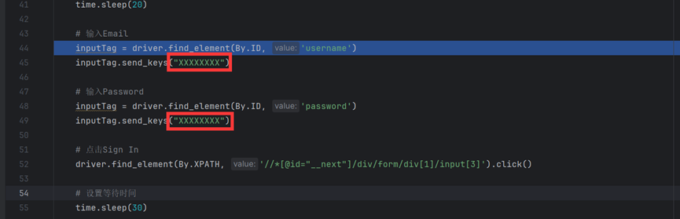

# 简介:

    我不会英文，因此介绍将是中文的，但我会使用最简单的语言去说明，这样方便进行翻译。

这是一个通过已经预先写好的词条进行随机组合的工具，制作这个工具的目的是绘制色情图片。它能自动对多组词条按顺序进行随机拼接，然后输入到nai3的提示词框中，并且点击生成，实现自动化图片生成。在演示中，我组合的词条是角色名+画风+表情+动作+场景，这一套简单的随机组合就能完成各种色情图片的随机绘制。
特别感谢青秋和小旋风柴郡（8号）对工具的建议及修改，为工具的完善提供了很多帮助。

# 环境：
* Chrome浏览器
* Selenium 
* chromedriver
* openpyxl

# 可用脚本：
* randomize：简单的提示词随机脚本，适用于短时间挂机（1-2小时）
* extended idle time：randomize升级版，适用于长时间挂机（无上限）
* 不断点击功能：不停的帮你点击生成，适用于平时生图

# randomize：

### 1.账号登入

首先，你需要输入在红框输入你的账号和密码，xxxxxxxx是你需要更换的地方，让程序进行账户登录。
### 2.设置Prompt读取

在①的框内，写好你需要读取的Sheet，在②的框中，按顺序写好你要的Prompt结果。③是打印随机结果，如有需要请填写。

表格文本位于文件目录的Prompt，请自行填写，如果需要在运行途中修改Prompt，请在表格中修改，他会在下个随机开始时更新。

请不要在表格内放入无关的内容，因为它每次都需要重新读取。

在这个示例中，程序按照我预先在①框中填好的读取顺序，在Prompt中输出了结果，并且把随机结果打印到了②中

### 3.Excel读取规则

### 4.开始调试
接下来，可以从调试中运行了。请不要直接结束程序运行，因为它会直接关闭网页，所有图片都不会保存，因此，你需要先暂停程序，保存好图片后，再结束运行。 

### 5.其他可调节的参数
请参考我的注释

# extended idle time：
比randomize更多的功能，它适用于长时间挂机，由小旋风柴郡（8号）完成，感谢！
它的设置方法和randomize一致，因此我仅介绍新增功能。

在这里，我必须强调的是，请注意你的挂机时间，如果挂机时间过长导致封号，于本脚本制作人员无关。
### 1.和randomize的区别
#### 增加自动下载并刷新网页功能
#### 下载压缩包并以注释修改文件名移动到指定文件夹
#### 检测Prompt输入是否正常
#### 检测是否有掉线情况

### 2.修改文件下载路径

首先，你需要在红框位置，修改浏览器默认下载文件的位置，在这里，必须使用绝对路径。

然后，在红框①内填写你在上方填入的下载文件的位置，再在②的框中填入文件最终保存位置。

### 3.设置图片下载并刷新网页时间

在此处修改时间，推荐设置时间参考注释。

由于是长时间挂机，在这里我推荐将Prompt更替时间设置成更长的时间，例如：600及以上。

# 不断点击功能：

“这个是个很简单的功能，他会打开你的网页，等你进入生图界面后，它会帮你不断的点击生成。和之前一样，请从调试中运行它

# 注意事项:

虽然这个程序会自动帮你打开网页，但是预设依旧需要自己进行修改，特别是Add QualityTags的默认设置，负面默认使用的是HEAVY，这里需要手动修改。  

